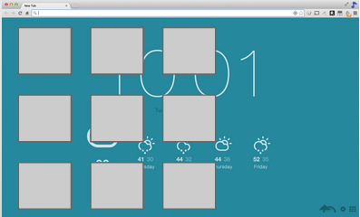
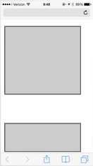

autoscale: true
footer: © New York Code + Design Academy 2016
slidenumbers: true

# Getting<br>Mobile<br>Friendly

---

# Why mobile friendly, or mobile first?

- To have a mobile-friendly design is to satisfy all of the different use cases for your website or web application

- Some users may log on from a desktop, others from a phone, still others from a tablet

- Providing an optimized experience for their device of choice will ensure a lower bounce rate and greater user satisfaction

- Some platforms even have the mobile version done first: mobile-first

---

# Achieving mobile-friendly-ness

- To have a mobile friendly website mostly boils down to two main points:

  - Your website works well regardless of the screen width it is being viewed at

  - Interactions that rely on a :hover event or the presence of a mouse need to also work in a touch-only environment

---

# Different widths, different CSS

- A media query allows you to specify CSS to use only in the case where a certain screen size (screen width or height) is being used

- The use of media queries to accommodate different breakpoints, or screen resolutions, has been popularized due to the increased use of mobile computing devices

---

# Anatomy of a media query

````css
// @media all -> apply this query to all device types
// (max-width: 960px) -> more specifically, apply styles to screens 960px and below
@media all and (max-width: 960px){
  body{
    background-color: orange;
  }
}
````

---

# `max-width`, `min-width`, etc

- `max-width` and `min-width` are used to set the boundaries of a media query

- The following rule would apply to anybody viewing your page between 481px and 960px window width:

````css
@media all and (max-width: 960px) and (min-width: 481px)
````

---

# `max-width`, `min-width`, etc

The following rule would apply to anybody viewing your page with a browser width below 480px:

````css
@media all and (max-width: 480px)
````

The following rule would apply to anybody viewing your page with a browser width above 1300px:

````css
@media all and (min-width: 1300px)
````

---

# Use cases: TMI

- A media query can be used to show or hide certain elements on the page based on the page's width

- For instance, perhaps you have an "additional information" section on an event that would be a bit of information overload on a mobile device

- Use display: none; to hide the section on mobile devices only with a media query

---

# Use cases: grids

A page with items aligned next to each other might need each of them to have a margin on the left in order to put some space between the items on a desktop view



---

# Use cases: grids

On the mobile side, we'll need to remove the margin left for our items to stack neatly without extra space



---

# Before implementation: viewport

In order to ensure proper rendering and touch zooming, add the viewport meta tag to the <head> section of your website:

````html
<meta name="viewport" content="width=device-width, initial-scale=1">
````

---

# Exercise

- Build an image gallery using floats and background-image on <div>s instead of  tags that:

  - also looks good when the browser is resized to 400px

  - uses a different, smaller background-image for each image when the browser is resized

  - has a frame around each image in full-size width and no frame at 400px

- To get a readout of the browser width, make sure the Chrome Developer tools are open (`Command + Option + I`)

---

# Breakpoint location best practices

- There are differing philosophies on the best way to lay out your break points

- Mobile-first: you don't have a breakpoint for mobile devices but instead, your design begins at the mobile level and extends from there

- Desktop-first: you build your website for the desktop, then make it mobile and larger-screen friendly from there

---

# Mobile first

````css
/* smaller than a tablet is the default design*/

/* Small devices (tablets, 768px and up) */
@media (min-width: 768px) { ... }

/* Medium devices (desktops, 992px and up) */
@media (min-width: 992px) { ... }

/* Large devices (large desktops, 1200px and up) */
@media (min-width: 1200px) { ... }
````
---

# Desktop first

````css
/* Large desktop */
@media (min-width: 1200px) { ... }

/* Portrait tablet to landscape and desktop */
@media (min-width: 768px) and (max-width: 979px) { ... }

/* Landscape phone to portrait tablet */
@media (max-width: 767px) { ... }

/* Landscape phones and down */
@media (max-width: 480px) { ... }

````
---
# Example source

- These media queries were taken from versions 2 and 3 of Bootstrap, a popular responsive web design framework

- Version 2 of this framework was "desktop-first", while version 3 was "mobile-first"

- You can use whatever breakpoints you'd like, but this is a good starting point

---

# Testing your responsive designs

- The first way a responsive design is usually tested is to just resize your browser window

- Chrome also has a built in device emulation feature, though it's not always 100% accurate

- You can also run device emulators, for instance the iOS device emulator inside of XCode

---

# Testing your responsive designs

- The best way a responsive design is tested is by actually using it on a target device

- Of course, we can't all afford every device and device version ever

- Put your website on a password protected server and take a walk over to the Apple or Sony Store for some peace of mind…

---

# Understanding responsive design

The classic article:
[http://alistapart.com/article/responsive-web-design](http://alistapart.com/article/responsive-web-design)

Everyone please take a moment to read this article, then we'll move on.

--

# Exercise

Using the provided `acme-desktop` and `acme-mobile` png files as a reference, create a desktop-friendly and mobile-friendly version of the ACME homepage using breakpoints

---

# Extended Exercise

- Take an existing project (or three) and make them mobile friendly

- You have the rest of the lesson to work on this and increase your understanding of media queries/mobile-friendly design!
